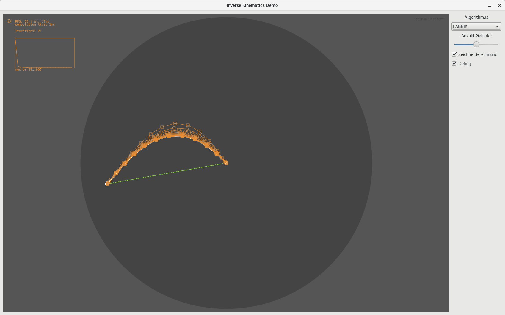

# 2D-Demo Inverse Kinematik
Eine 2D-Demo zur Veranschaulichung folgender Algorithmen zum Thema "Inverse Kinematik":
- Analytisches Verfahren für eine planare Zwei-Gelenk-Kette
- Transponierte Jacobimatrix
- Pseudoinverse Jacobimatrix
- Forward and Backward Reaching Inverse Kinematics (FABRIK)

## Compilieren
Das Compilieren erfordert das Qt-SDK in der Version 5.6.

Das Compilieren übernimmt dann `./compile.sh`
